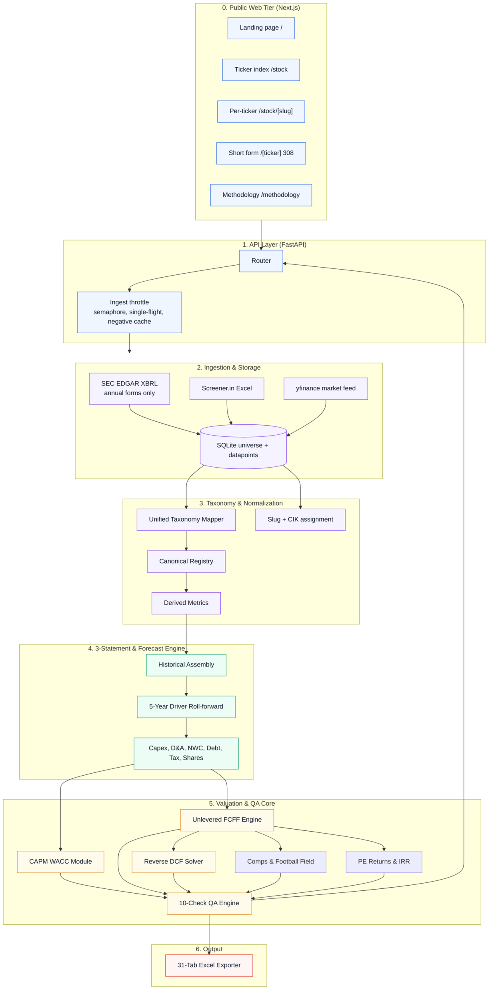

# Valence — Equity Valuation & Financial Modeling Workbench

<p align="center">
  
</p>

Valence is a browser-based equity valuation workbench. It ingests filings, normalizes them into a canonical taxonomy, runs a driver-based five-year three-statement forecast, discounts unlevered FCFF at a CAPM-derived WACC, solves the reverse DCF, benchmarks public comps, runs a ten-check accounting and model audit, and exports the whole thing to a 31-tab Excel workbook with live formulas.

Every company has its own public URL. `valence.sourabhpradhan.in/NVDA` is a deep link that opens with the model already in the HTML, so the figures are readable before any script runs.

---

## Key Features

- **Per-ticker deep links.** Every covered company has a canonical page at `/stock/{slug}`, with `/NVDA` as a short form that redirects to it. The model is server-rendered and revalidated hourly, so a shared link is a working link rather than an empty shell.
- **Driver-Based 5-Year Forecasting Engine**: Income Statement, Balance Sheet, and Cash Flow across **Base**, **Bull**, and **Bear** scenarios, driven by operational metrics (Revenue Growth, EBITDA/EBIT Margins, CapEx % Revenue, D&A %, DSO, DPO, Tax Rate).
- **Institutional DCF & WACC Buildup**: full Free Cash Flow to Firm build with non-cash operating working capital, dynamic WACC (CAPM cost of equity plus tax-shielded cost of debt), Gordon Growth and Exit EV/EBITDA terminal values, and an Enterprise Value to Implied Share Price bridge.
- **Dynamic Reverse DCF & 2D Sensitivity**: solves for the market-implied perpetuity growth rate by exact closed-form inversion, paired with live two-way sensitivity grids over WACC against terminal growth and exit multiple. When no growth rate in a sane band can reproduce the market price, the solver returns nothing rather than a number it cannot justify.
- **Public Trading Comps & Football Field Synthesis**: benchmarks the company against sector peers (EV/Sales, EV/EBITDA, P/E, FCF Yield %, ROIC %) and synthesizes cross-methodology valuation ranges. *Football field and comps are Excel-export features; the web workbench shows the DCF and the scenario matrix.*
- **Private Equity Exit Returns & IRR Waterfall**: 3-year and 5-year Exit Equity Value, MoIC, and Equity IRR under each exit scenario with entry-price sensitivity grids.
- **Multi-Market & Multi-Currency Support**: US equities (NASDAQ/NYSE, USD millions) and Indian equities (NSE/BSE, INR crores), with currency and unit localization across all statements.
- **Ten-Check QA Engine**: balance sheet balancing, cash flow reconciliation, debt schedule ties, share count consistency, DCF bridge tie-out, WACC validity, terminal growth below WACC, missing critical inputs, data provenance quality, and historical reporting coverage. A model with failing checks is still served, with the failures listed. A check that could not run is marked skipped and is never counted as a pass.
- **31-Tab Interactive Excel Exporter**: detail schedules drive the operating model through live Excel formulas (CAPM, FCFF sums, cross-sheet references, sensitivity grids, and live `=IF(...)` audit checks).
- **Live Web Workbench**: scenario switching, driver overrides with revert, methodology breakdown, and a model library kept in the browser.

### Deliberate design decisions

These look like gaps and are not. They are recorded here so nobody "fixes" them.

- **Annual filings only.** SEC ingestion accepts facts from annual forms (`10-K`, `20-F`, `40-F` and their amendments) and keeps only duration facts spanning 330 to 400 days, so 10-Q quarters are never read. A DCF built on annual statements is the institutional standard, and mixing quarters into an annual-period forecast would misstate the growth anchor. Statements six to twelve months old is the correct reading, not staleness.
- **Throttled live ingestion.** `VALENCE_INGEST_CONCURRENCY` defaults to 2. Measured on a single instance: one cached specification costs 1.15 MB resident, so a 50-entry cache is about 58 MB against 512 MB, and a live build costs 2.5 MB over roughly seven seconds. Memory is not the binding constraint. What remains is politeness toward the upstream filing and market-data providers, which rate-limit under concurrency. Raise it alongside a provider measurement, not a memory one.
- **Single-flight builds.** A slug that is being built is not built twice, an unsourceable slug is negatively cached, and the cache is an LRU of 50.
- **Prices self-heal.** A live quote failure falls back to the last cached close *preserving the original date*, and the UI says so rather than presenting a stale number as current.

---

## System Architecture



---

## Tech Stack

- **Core Engine**: Python 3.12, Pydantic v2
- **API**: FastAPI, Uvicorn, Requests
- **Excel Renderer**: OpenPyXL (live formulas via OpenXML value patching)
- **Database & Persistence**: SQLite, precomputed model cache on disk
- **Frontend**: Next.js 16.3.6 (App Router), React 19, Tailwind CSS v4, TypeScript

---

## Project Structure

```
Valence/
├── backend/
│   ├── api/
│   │   ├── main.py                    # FastAPI app factory
│   │   ├── routes.py                  # Endpoints, slug allowlist, spec build & cache
│   │   ├── throttle.py                # Ingest semaphore, single-flight, negative cache
│   │   └── static/                    # Legacy SPA assets and icon
│   ├── data/
│   │   ├── ingestion/                 # Source-specific parsers
│   │   │   ├── sec_edgar.py           # US SEC XBRL company facts (annual forms only)
│   │   │   ├── screener.py            # India Screener.in Excel parser
│   │   │   ├── india_live.py          # Live India market data
│   │   │   └── us_live.py             # Live US market data
│   │   ├── universe/
│   │   │   ├── models.py              # Raw database schemas
│   │   │   ├── store.py               # SQLite reader/writer, universe queries
│   │   │   ├── slugs.py               # Public slug + CIK assignment
│   │   │   └── master_list.py         # Covered tickers and markets
│   │   ├── pipeline.py                # Ingestion orchestration
│   │   └── precompute.py              # Model cache precomputation
│   ├── export/excel/                  # 31-sheet openpyxl renderer
│   │   ├── builder.py                 # Low-level utilities & OpenXML string patcher
│   │   ├── exporter.py                # Export runner
│   │   ├── render_front.py            # Cover, guide, executive summary, tab manifest
│   │   ├── render_hist.py             # Historical statements
│   │   ├── render_fcst.py             # Operating model and schedules
│   │   ├── render_val.py              # WACC, DCF, comps, football field, returns
│   │   ├── render_qa.py               # Documentation and dynamic QA checks
│   │   ├── self_check.py              # Sheet contract assertions
│   │   └── styles.py                  # Formatting and color tokens
│   ├── forecast/                      # engine, assumptions, debt, share_count
│   ├── models/                        # Pydantic contracts (spec, statements)
│   ├── normalization/                 # taxonomy/ and financials/
│   ├── validation/                    # accounting_checks.py, pipeline.py
│   ├── valuation/                     # dcf, wacc, reverse_dcf, comps,
│   │                                  # football_field, returns, sensitivity
│   └── tests/                         # Pytest suite
├── frontend/
│   ├── src/app/
│   │   ├── page.tsx                   # Landing page
│   │   ├── layout.tsx                 # Metadata, tokens, browser surfaces
│   │   ├── stock/page.tsx             # Ticker index
│   │   ├── stock/[ticker]/            # Per-ticker page, share card, JSON-LD
│   │   ├── [ticker]/                  # Short-form redirector
│   │   ├── methodology/page.tsx
│   │   ├── not-found.tsx
│   │   ├── sitemap.ts, robots.ts, manifest.ts
│   │   ├── icon.png, favicon.ico, apple-icon.png
│   ├── src/components/                # Workbench views, modals, landing blocks
│   ├── src/lib/                       # API client, formatters, tickers, site config
│   └── public/media/                  # Launch clip and poster
├── assets/                            # Gitignored: plans, reviews, screenshots, media sources
└── README.md
```

---

## Getting Started

### Prerequisites

- **Python 3.12+**
- **Node.js 20+** (the floor Next.js 16 requires)

There is no `requirements.txt`; the backend's third-party dependencies are:

```bash
pip install fastapi uvicorn pydantic openpyxl requests pdfplumber yfinance
```

`pytest` is needed to run the suite.

### Installation

```bash
git clone https://github.com/karbburn/Valence.git
cd Valence

python -m venv venv
# Windows:  venv\Scripts\activate
# macOS/Linux: source venv/bin/activate
pip install fastapi uvicorn pydantic openpyxl requests pdfplumber yfinance pytest

cd frontend && npm install
```

### Configuration

Optional. Everything below has a working default.

```env
# backend/.env
SEC_CONTACT_EMAIL=you@example.com     # SEC requires a monitored contact in the User-Agent
TWELVEDATA_API_KEY=                   # optional market-data provider
VALENCE_INGEST_CONCURRENCY=2          # in-flight live builds
VALENCE_INGEST_NEGATIVE_TTL=900       # seconds to remember an unsourceable slug
```

```env
# frontend/.env.local
NEXT_PUBLIC_API_URL=http://127.0.0.1:8111
NEXT_PUBLIC_SITE_URL=http://localhost:3000
```

`NEXT_PUBLIC_API_URL` is read at **build** time, not only at runtime. The pages
are prerendered, so a build without it will find no companies to prerender and
the index will render empty.

### Running

Backend:

```bash
python -m uvicorn backend.api.main:app --host 127.0.0.1 --port 8111
```

Frontend, in a second terminal:

```bash
cd frontend
npm run dev
```

| Route | What it is |
| :--- | :--- |
| `/` | Landing page |
| `/stock` | Covered tickers, searchable |
| `/stock/NVDA` | A company's model, server-rendered |
| `/NVDA` | Short form, 308s to the canonical URL |
| `/methodology` | How the valuation is built, and what it cannot do |

`/api/*` is proxied from the frontend to `NEXT_PUBLIC_API_URL`, so the browser
never makes a cross-origin request.

### Excel export

```bash
curl -o model.xlsx "http://127.0.0.1:8111/api/export/excel?company_id=nvda_us"
```

---

## Tests

```bash
# Engine, export and layout contracts
python -m pytest backend/tests -q

# Excel exporter self-check: asserts the 31-sheet contract and formula wiring
python -m backend.export.excel.self_check

# Web API and recomputation self-check
python -m backend.api.self_check

# Frontend unit tests, typecheck, lint, production build
cd frontend && npm test && npx tsc --noEmit && npm run lint && npm run build
```

278 backend tests and 20 frontend tests. A commit that touches `backend/` is not
finished until the backend suite passes; it takes about eight minutes and it is
the only thing guarding the engine.

---

## Core API Endpoints

| Method | Endpoint | Description |
| :--- | :--- | :--- |
| `GET` | `/api/health` | Liveness |
| `GET` | `/api/model/{company_id}` | Full `ModelSpecification` JSON |
| `POST` | `/api/model/recompute` | Apply driver overrides, return updated model |
| `POST` | `/api/model/revert` | Revert an override to baseline |
| `GET` | `/api/export/excel` | 31-tab `.xlsx` workbook |
| `GET` | `/api/companies` | Covered companies |
| `GET` | `/api/companies/manifest` | Paged universe with `slug` and `has_model` |
| `GET` | `/api/companies/resolve` | Resolve one public slug to a company |
| `GET` | `/api/companies/search` | Ticker and name autocomplete |

`/api/companies/resolve` is the security boundary for the public page routes.
`/api/model/{company_id}` will attempt live third-party ingestion for any
pattern-valid id, so a page route that passed unknown segments straight through
would let any well-formed URL start an ingestion. Unknown slugs 404 rather than
redirecting somewhere plausible.

Saved models live in the browser (`localStorage`). Nothing is uploaded or
synchronised.

---

## Licensing & Data

Figures come from public filings (SEC EDGAR, Screener.in) and public market-data
providers. Prices refresh daily. Valuation output is model-generated and is not
a recommendation or investment advice.

Built by [Sourabh Pradhan](https://www.sourabhpradhan.in/).
