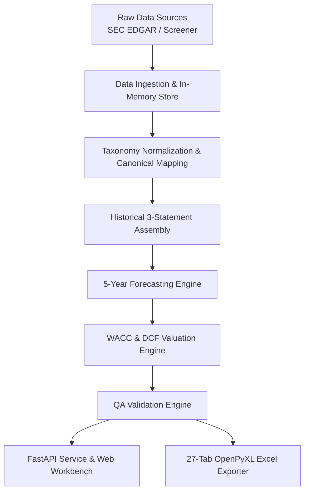

# Valence — Equity Valuation & Financial Modeling Workbench

<p align="center">
  
</p>

Valence is a high-performance equity valuation and 3-statement financial modeling platform. It integrates financial data ingestion, taxonomy normalization, driver-based 5-year forecasting, WACC estimation via CAPM, dual terminal value methodologies, reverse DCF growth solvers, automated accounting QA validation, a 27-tab Excel model exporter with live formulas, and a real-time web dashboard.

---

## Key Features

- **Driver-Based 5-Year Forecasting Engine**: Project Income Statement, Balance Sheet, and Cash Flow Statement across **Base**, **Bull**, and **Bear** scenarios driven by operational metrics (Revenue Growth, EBITDA/EBIT Margins, CapEx % Revenue, D&A %, DSO, DPO, Tax Rate).
- **Institutional-Grade DCF & WACC Buildup**: Full Free Cash Flow to Firm (FCFF) calculation, dynamic WACC estimation (CAPM cost of equity + tax-shielded cost of debt), Gordon Growth & Exit EV/EBITDA Multiple terminal values, and Enterprise Value to Implied Share Price bridge.
- **Reverse DCF & Sensitivity Analysis**: Solves for the implied terminal growth rate or revenue CAGR required to justify current market prices, paired with 2D sensitivity grids (WACC vs Terminal Growth).
- **Multi-Market & Multi-Currency Support**: Support for both Indian equities (NSE/BSE in INR Crores) and US equities (NASDAQ/NYSE in USD Millions), including ADR adjustments.
- **Automated Accounting & Model QA Engine**: Runs 9 rigorous validation checks (Balance Sheet balancing, Cash Flow reconciliation, Debt schedule ties, Share count consistency, DCF bridge tie-out, WACC bounds, and input completeness).
- **27-Tab Excel Export**: Generates `.xlsx` workbooks featuring live Excel formulas (CAPM, FCFF sums, cross-sheet references) and cover page branding.
- **Real-Time Web Workbench**: Single-Page Application (SPA) dashboard inspired by TradingView, Screener, and Bloomberg Terminal UI. Allows live driver overrides, instant recomputation, scenario switching, company search, and persistent model storage.

---

## System Architecture



---

## Tech Stack

- **Core Logic & Engine**: Python 3.12, Pydantic v2
- **Web API**: FastAPI, Uvicorn, Requests
- **Excel Generation**: OpenPyXL, Pillow (image branding)
- **Database & Persistence**: SQLite (`valence.db`)
- **Frontend Dashboard**: HTML5, Vanilla JavaScript (ES6+), Custom CSS (Dark Theme Design System)

---

## Project Structure

```
Valence/
├── backend/
│   ├── api/                  # FastAPI routes, auth, persistence, static files
│   │   ├── static/           # SPA Web Dashboard (index.html, styles.css, app.js, icons)
│   │   └── main.py           # FastAPI app entry point
│   ├── data/                 # Data ingestion pipelines, SEC/Screener parsers, universe store
│   ├── export/               # OpenPyXL Excel exporter (27-tab workbook engine)
│   ├── forecast/             # 5-year driver forecast engine, debt schedule, share count
│   ├── models/               # Pydantic schemas, historical statement structures
│   ├── normalization/        # Taxonomy mapping registry & canonical metric derivations
│   ├── validation/           # QA model validation checks & diagnostic pipeline
│   └── valuation/            # DCF, WACC (CAPM), Reverse DCF, and Sensitivity analysis
├── assets/                   # Design assets, icon, and system architecture docs
└── README.md
```

---

## Getting Started

### Prerequisites

- **Python 3.12+**
- `pip` (Python package manager)

### Installation

1. Clone the repository:
   ```bash
   git clone https://github.com/karbburn/Valence.git
   cd Valence
   ```

2. Create and activate a virtual environment (optional but recommended):
   ```bash
   python -m venv venv
   # On Windows:
   venv\Scripts\activate
   # On macOS/Linux:
   source venv/bin/activate
   ```

3. Install required dependencies:
   ```bash
   pip install fastapi uvicorn pydantic openpyxl requests pillow python-dotenv
   ```

4. Configure environment variables (Optional for market data API keys):
   Create a `.env` file in the project root:
   ```env
   TWELVEDATA_API_KEY=your_api_key_here
   ```

---

## Running the Platform

### 1. Launch the Web Dashboard & API

Start the FastAPI application server:
```bash
python -m uvicorn backend.api.main:app --host 0.0.0.0 --port 8000 --reload
```
Open your browser and navigate to:
```
http://localhost:8000
```

### 2. Exporting Excel Workbooks via API

You can generate and download a 27-tab financial model directly via HTTP:
```bash
curl -O "http://localhost:8000/api/export/excel?company_id=infy_infy"
```

---

## Verification & Self-Checks

Run the automated self-check test suites to verify Excel generation and API endpoints:

```bash
# Run Excel Exporter Self-Check
python -m backend.export.excel.self_check

# Run Web API & Recomputation Self-Check
python -m backend.api.self_check
```

---

## Core API Endpoints

| Method | Endpoint | Description |
| :--- | :--- | :--- |
| `GET` | `/api/model/{company_id}` | Fetch full ModelSpecification JSON for a company |
| `POST` | `/api/model/recompute` | Apply analyst driver overrides and return updated model |
| `POST` | `/api/model/revert` | Revert driver override back to baseline model state |
| `GET` | `/api/export/excel` | Download fully-formatted 27-tab `.xlsx` workbook |
| `GET` | `/api/companies` | List all available onboarded companies |
| `GET` | `/api/companies/search` | Real-time ticker and company name autocomplete |
| `POST` | `/api/models/save` | Persist user's model scenario overrides |
| `GET` | `/api/models` | List user's saved model scenarios |
