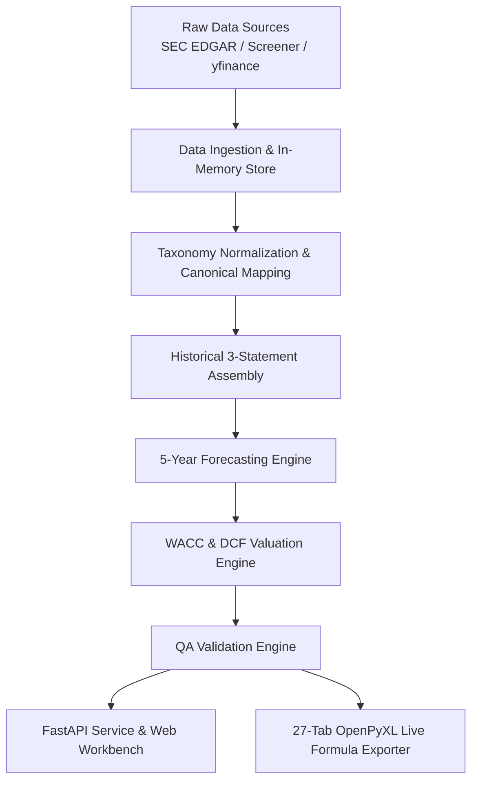

# Valence — Equity Valuation & Financial Modeling Workbench

<p align="center">
  
</p>

Valence is a high-performance equity valuation platform and 3-statement financial modeling workbench. It integrates multi-source financial data ingestion, taxonomy normalization, driver-based 5-year forecasting, WACC estimation via CAPM, dual terminal value methodologies, reverse DCF growth solvers, automated accounting QA validation, a 27-tab Excel model exporter with live dynamic formulas, and a real-time web dashboard.

---

## Key Features

- **Driver-Based 5-Year Forecasting Engine**: Project Income Statement, Balance Sheet, and Cash Flow Statement across **Base**, **Bull**, and **Bear** scenarios driven by operational metrics (Revenue Growth, EBITDA/EBIT Margins, CapEx % Revenue, D&A %, DSO, DPO, Tax Rate).
- **Institutional DCF & WACC Buildup**: Full Free Cash Flow to Firm (FCFF) build with clean Non-Cash Operating Working Capital ($\Delta NWC$), dynamic WACC estimation (CAPM cost of equity + tax-shielded cost of debt), Gordon Growth & Exit EV/EBITDA Multiple terminal values, and Enterprise Value to Implied Share Price bridge.
- **Dynamic Reverse DCF & 2D Sensitivity**: Solves for market-implied perpetuity growth rates via exact closed-form inversion formulas, paired with live 2D sensitivity formula grids (WACC vs. Terminal Growth & Exit Multiple).
- **Multi-Market & Multi-Currency Support**: Native support for US equities (NASDAQ/NYSE in USD Millions) and Indian equities (NSE/BSE in INR Crores), with dynamic currency and unit localization across all financial statements.
- **Automated Accounting & Model QA Engine**: Executes 9 rigorous validation checks (Balance Sheet balancing, Cash Flow reconciliation, Debt schedule ties, Share count consistency, DCF bridge tie-out, WACC bounds, and data quality).
- **27-Tab Interactive Excel Exporter**: Generates 100% dynamic `.xlsx` workbooks where detail schedules drive the forecast operating model (`20_Operating_Model`), featuring live Excel formulas (CAPM, FCFF sums, cross-sheet references, 2D sensitivity grids, and live `=IF(...)` audit checks).
- **Real-Time Web Workbench**: Single-Page Application (SPA) dashboard inspired by Bloomberg Terminal and TradingView UI. Supports live driver overrides, instant recomputation, scenario switching, company search, and persistent model scenario storage.

---

## System Architecture



---

## Tech Stack

- **Core Engine**: Python 3.12, Pydantic v2
- **Web API**: FastAPI, Uvicorn, Requests
- **Excel Renderer**: OpenPyXL, Pillow (image branding & OpenXML formula patching)
- **Database & Persistence**: SQLite (`valence.db`)
- **Frontend Dashboard**: HTML5, Vanilla JavaScript (ES6+), Custom CSS (Dark Theme Design System)

---

## Project Structure

```
Valence/
├── backend/
│   ├── api/                  # FastAPI routes, auth, persistence, static files
│   │   ├── static/           # SPA Web Dashboard (index.html, styles.css, app.js, icons)
│   │   └── main.py           # FastAPI app entry point
│   ├── data/                 # Data ingestion pipelines, SEC/Screener parsers, universe store
│   ├── export/               # OpenPyXL Excel exporter (27-tab workbook engine)
│   │   └── excel/            # Tab-by-tab formula renderers & OpenXML patched builder
│   ├── forecast/             # 5-year driver forecast engine, debt schedule, share count
│   ├── models/               # Pydantic schemas, historical statement structures
│   ├── normalization/        # Taxonomy mapping registry & canonical metric derivations
│   ├── validation/           # QA model validation checks & diagnostic pipeline
│   └── valuation/            # DCF, WACC (CAPM), Reverse DCF, and Sensitivity analysis
└── README.md
```

---

## Getting Started

### Prerequisites

- **Python 3.12+**
- `pip` (Python package manager)

### Installation

1. Clone the repository:
   ```bash
   git clone https://github.com/karbburn/Valence.git
   cd Valence
   ```

2. Create and activate a virtual environment (optional but recommended):
   ```bash
   python -m venv venv
   # On Windows:
   venv\Scripts\activate
   # On macOS/Linux:
   source venv/bin/activate
   ```

3. Install required dependencies:
   ```bash
   pip install fastapi uvicorn pydantic openpyxl requests pillow python-dotenv
   ```

4. Configure environment variables (Optional for market data API keys):
   Create a `.env` file in the project root:
   ```env
   TWELVEDATA_API_KEY=your_api_key_here
   ```

---

## Running the Platform

### 1. Launch the Web Dashboard & API

Start the FastAPI application server:
```bash
python -m uvicorn backend.api.main:app --host 0.0.0.0 --port 8000 --reload
```
Open your browser and navigate to:
```
http://localhost:8000
```

### 2. Exporting Excel Workbooks via API

Generate and download a 27-tab financial model directly via HTTP:
```bash
curl -O "http://localhost:8000/api/export/excel?company_id=msft_us"
```

---

## Verification & Institutional Audit Suite

Valence includes an automated **Institutional Financial Audit Suite** for post-export verification across generated `.xlsx` workbooks (`msft_valuation_model.xlsx`, `nvda_valuation_model.xlsx`, `ongc_valuation_model.xlsx`, `tcs_valuation_model.xlsx`):

- **3-Statement Accounting Equality**: Verifies `Total Assets = Total Liabilities + Total Equity` for all historical and forecast periods (FY24–FY31) with zero balance sheet gap.
- **Financial Math Tie-Outs**:
  - **EV Tie-out**: `EV = Sum(PV FCFF) + PV(TV)` ($\Delta = 0.0000$).
  - **Net Debt Cash Bridge**: `Net Debt = Total Debt - Liquid Cash & Investments` ($\Delta = 0.0000$).
  - **Equity Value Tie-out**: `Equity Value = EV - Net Debt` ($\Delta = 0.0000$).
  - **Implied Share Price**: `Price = Equity Value / Diluted Shares` ($\Delta < 0.005$).
- **Live Excel Formula Verification**:
  - **Forward Operating Model**: `20_Operating_Model` is driven by live formulas linking to Schedules 21–26.
  - **2D Sensitivity Grids**: `33_Sensitivity` grid cells evaluate live 2D Excel formulas for WACC $\times$ Growth and WACC $\times$ Multiple.
  - **Reverse DCF Solver**: `34_Reverse_DCF` Row 10 uses a live closed-form algebraic formula.
  - **Dynamic Model Checks**: `52_Model_Checks` evaluates live `=IF(...)` formulas returning `"PASS"` or `"FAIL"`.
- **Institutional Visual Branding**:
  - **`By Sourabh` Signature**: 14pt bold blue signature hyperlink on `00_Cover` cell `B20` hyperlinked to [sourabh08.vercel.app](https://sourabh08.vercel.app/).
  - **Consolas Formula Code Blocks**: `01_Model_Guide` Column C formulas styled in `Consolas 11pt Bold` with light blue tint fill (`#EFF6FF`).

```bash
# Run Institutional Financial Audit & Excel Exporter Self-Check
python -m backend.export.excel.self_check

# Run Web API & Recomputation Self-Check
python -m backend.api.self_check
```

---

## Core API Endpoints

| Method | Endpoint | Description |
| :--- | :--- | :--- |
| `GET` | `/api/model/{company_id}` | Fetch full ModelSpecification JSON for a company |
| `POST` | `/api/model/recompute` | Apply analyst driver overrides and return updated model |
| `POST` | `/api/model/revert` | Revert driver override back to baseline model state |
| `GET` | `/api/export/excel` | Download fully-formatted 27-tab `.xlsx` workbook |
| `GET` | `/api/companies` | List all available onboarded companies |
| `GET` | `/api/companies/search` | Real-time ticker and company name autocomplete |
| `POST` | `/api/models/save` | Persist user's model scenario overrides |
| `GET` | `/api/models` | List user's saved model scenarios |
